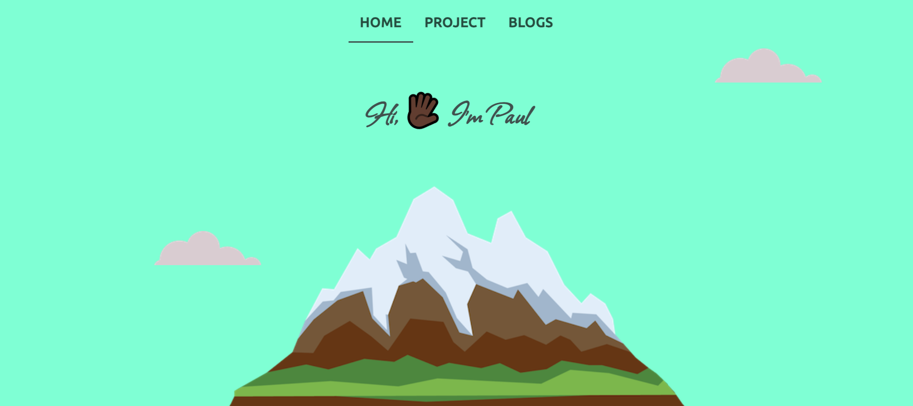

# Portfolio

Personal Portfolio website

## Live

[Kiron Paul](https://paul889-portfolio.netlify.app/)

## Description

- I've listed all my projects and blogs and social media accounts where you can connect with me.

## Technology

- I've used HTML,css & vanillaJS to make the website

## Blogs

- Blogs that I have written on [Dev.io](https://dev.to/paulcoder22)

## Projects

- All levelZero projects of [neoGcamp](https://neog.camp)
- Personal projects that I have built to test my skills
